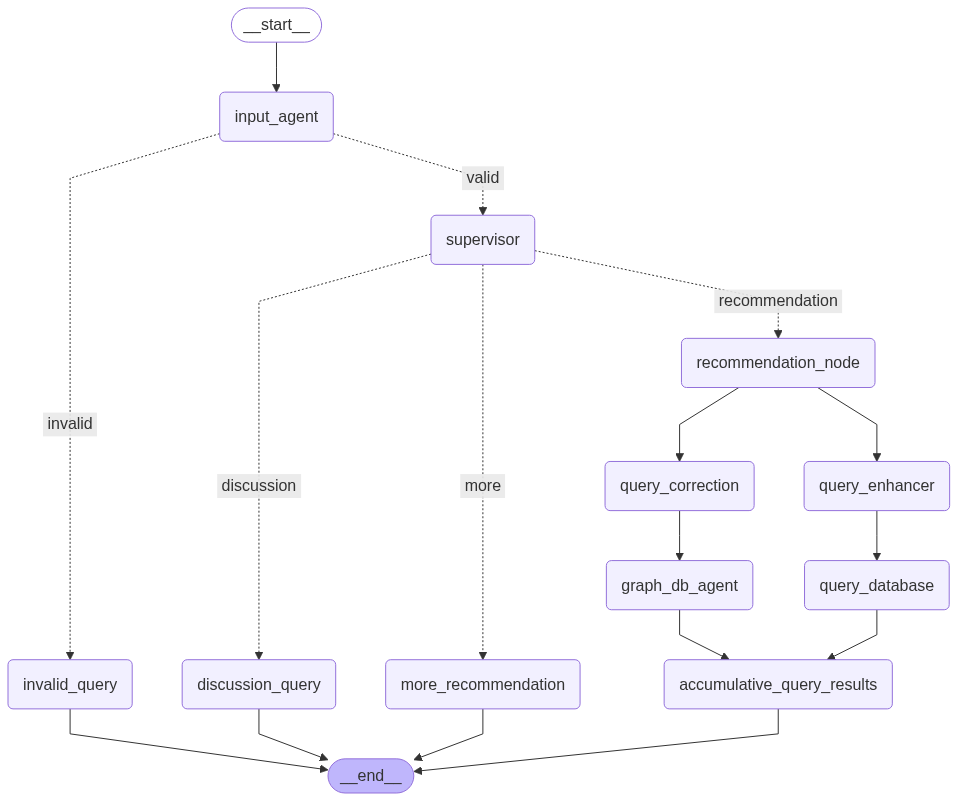

# FindMyHome
A Multi‑agent based property recommendation system using LangGraph, Neo4j (Graph DataBase), Postgres, Azure OpenAI, and Redis-backed long‑term, short-term memory

## Tech Stack
• Orchestration: LangGraph
• LLMs: Azure OpenAI (chat + embeddings) 
• Graph DB: Neo4j
• SQL DB: Postgres/Neon; vector similarity using pgvector-compatible array casting
• Persistence: SQLAlchemy for users/chats; Redis for checkpoints

## Architecture
• Multi-agent graph (LangGraph) in src/findmyhome/workflow.py:
  • input_agent → validates domain relevance
  • supervisor → routes to recommendation, discussion, or more results
  • query_correction → normalizes user intent for graph search
  • query_enhancer → extracts structured filters for SQL/vector search
  • graph_db_agent → generates Cypher and queries Neo4j
  • sql_agent (query_database_agent) → queries Postgres with filters + embedding similarity
  • accumulative_query_results → merges/dedupes and summarizes unified recommendations
  • discussion_agent → answers follow‑ups about shown properties

The Multiagent Architecture Schema using Langgraph


## GraphDB Schema:
Node properties: <br>

• Property: id, name, totalArea, pricePerSqft, price, beds, baths, hasBalcony, description
• Neighborhood: name
• City: name
• PropertyType: name
• RoomType: name, rooms

Relationships: <br>

• (:Property)-[:IN_NEIGHBORHOOD]->(:Neighborhood)
• (:Property)-[:OF_TYPE]->(:PropertyType)
• (:Property)-[:HAS_LAYOUT]->(:RoomType)
• (:Neighborhood)-[:PART_OF]->(:City)


## Setup

1) Python 3.10+ and a virtualenv
2) Copy `.env.example` to `.env` and fill values (Azure OpenAI, Neo4j, Postgres)
3) Install using requirements.txt:
```
pip install -r requirements.txt
```


## Running

- CLI (interactive chat):
```
python -m findmyhome.cli chat --thread-id 1 --user-id 2
# or if installed as script
findmyhome chat --thread-id 1 --user-id 2
```

- CLI (one-shot):
```
python -m findmyhome.cli query "show me 2 bhk in New Delhi under 1 cr" --thread-id 1 --user-id 2
# or
findmyhome query "show me 2 bhk in New Delhi under 1 cr"
```

- API server:
```
uvicorn findmyhome.api.server:app --reload
```

- Docker
Build and run:
```
docker build -t findmyhome .
docker run -p 8000:8000 --env-file .env findmyhome
```

- CI/CD
GitHub Actions at .github/workflows/main_findmyhome.yml:

• Builds and pushes image to Azure Container Registry
• Deploys to Azure Web App findmyhome

## Example Queries
• “2 BHK in New Delhi under 1 crore with balcony”
• “Villa in Bangalore with 1200+ sq ft”
• “More properties like the previous ones”
• “What was the price per sqft of the second option?” (discussion mode)