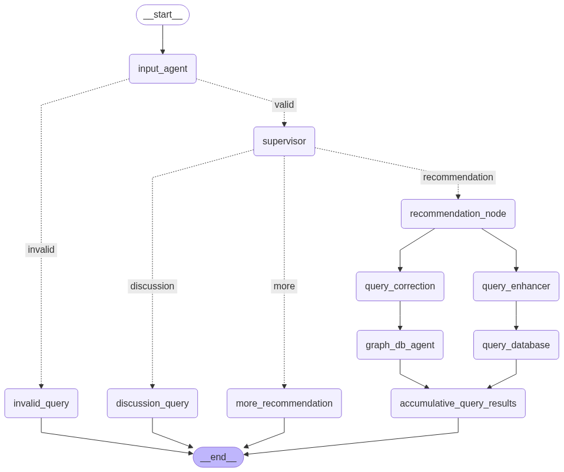
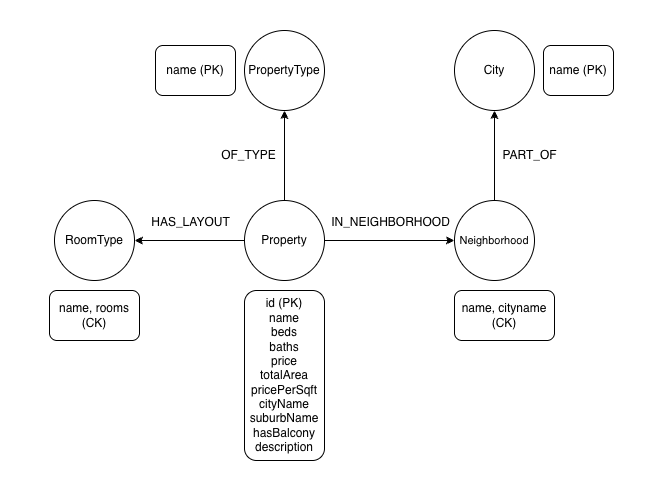

# FindMyHome 🏠
<div align="center">
    <h1></h1>
    <p>
         <b>A Multi‑agent Chat based Home recommendation system</b>
    </p>
</div>

## 🎥 Watch the Demo
See how the project works in action:
👉 [Watch the Demo Video](https://drive.google.com/file/d/1LOE5pmrk5grDyZOAMTa-2Xr20h40n7KJ/view?usp=sharing)
---
## 🚀 Try the Product
Experience it live:
👉 [FindMyHome](https://findmyhome-flax.vercel.app/)

## Features ✨
1. Request access
2. Create an account and sign in
3. Enter preferences to get initial recommendations
4. Chat to fetch more results or drill into any property
5. Start new chats for different searches
6. Update and refine your preferences anytime

### Note 📌
1. The number of queries is currently limited to **6 per account**.
2. Generating recommendations may take **1–2 minutes**, depending on processing time.

## Architecture 🧠
The multi-agent workflow is implemented in:
`src/findmyhome/workflow.py`

### Agent Flow Overview 🔄

- **[`input_agent`](src/findmyhome/agents/input.py)**  
  - Validates domain relevance of the user query.

- **[`supervisor`](src/findmyhome/agents/supervisor.py)**  
  Routes the request to one of:
  - Recommendation pipeline  
  - Discussion flow  
  - More results retrieval  

- **[`query_correction`](src/findmyhome/agents/query_correction.py)**  
  - Normalizes and refines user intent for graph search.

- **[`query_enhancer`](src/findmyhome/agents/query_enhancer.py)**  
  Extracts structured filters for:
  - SQL queries  
  - Vector similarity search  

- **[`graph_db_agent`](src/findmyhome/agents/graph_agent.py)**  
  - Generates Cypher queries and interacts with Neo4j.

- **[`query_database`](src/findmyhome/agents/sql_agent.py)**  
  Queries PostgreSQL using:
  - Structured filters  
  - Embedding similarity search  
  - Rerun the previous graph and sql queries to get more property recommendations.

- **[`accumulate`](src/findmyhome/agents/accumulate.py)**  
  Merges, deduplicates, and summarizes unified property recommendations.

- **[`discussion`](src/findmyhome/agents/discussion.py)**  
  Handles follow-up questions about previously shown properties.

**The Multiagent Architecture Schema using Langgraph**


## GraphDB Schema: 🗄️
Node properties: <br>
• Property: id, name, totalArea, pricePerSqft, price, beds, baths, cityName, hasBalcony, description, suburbName <br>
• Neighborhood: cityName, name <br>
• City: name <br>
• PropertyType: name <br>
• RoomType: name, rooms <br>

Relationships: <br>
• (:Property)-[:IN_NEIGHBORHOOD]->(:Neighborhood)<br>
• (:Property)-[:OF_TYPE]->(:PropertyType)<br>
• (:Property)-[:HAS_LAYOUT]->(:RoomType)<br>
• (:Neighborhood)-[:PART_OF]->(:City)<br>




## Running ▶️

- CLI (interactive chat):
```
python -m findmyhome.cli chat --thread-id 1 --user-id 2
# or if installed as script
findmyhome chat --thread-id 1 --user-id 2
```

- CLI (one-shot):
```
python -m findmyhome.cli query "show me 2 bhk in New Delhi under 1 cr" --thread-id 1 --user-id 2
# or
findmyhome query "show me 2 bhk in New Delhi under 1 cr"
```

- API server:
```
uvicorn findmyhome.api.server:app --reload
```

- Docker
Build and run:
```
docker build -t findmyhome .
docker run -p 8000:8000 --env-file .env findmyhome
```

- CI/CD
GitHub Actions at .github/workflows/main_findmyhome.yml:

## Example Queries 💬
• “2 BHK in New Delhi under 1 crore with balcony”<br>
• “Villa in Bangalore with 1200+ sq ft”<br>
• “More properties like the previous ones”<br>
• “What was the price per sqft of the second option?” (discussion mode)

